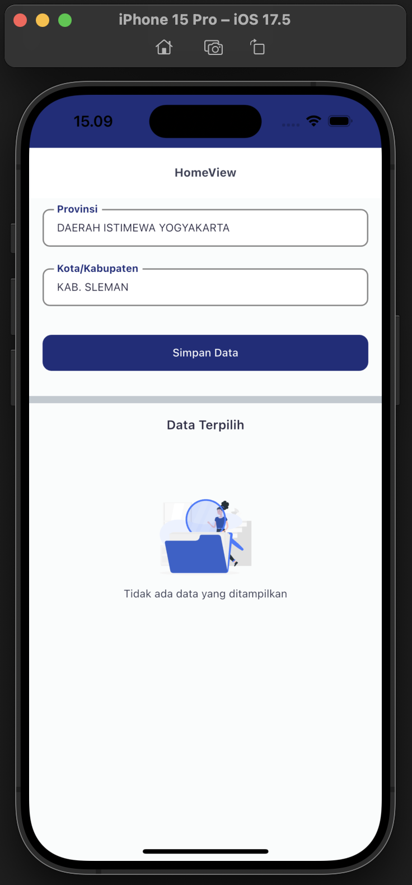
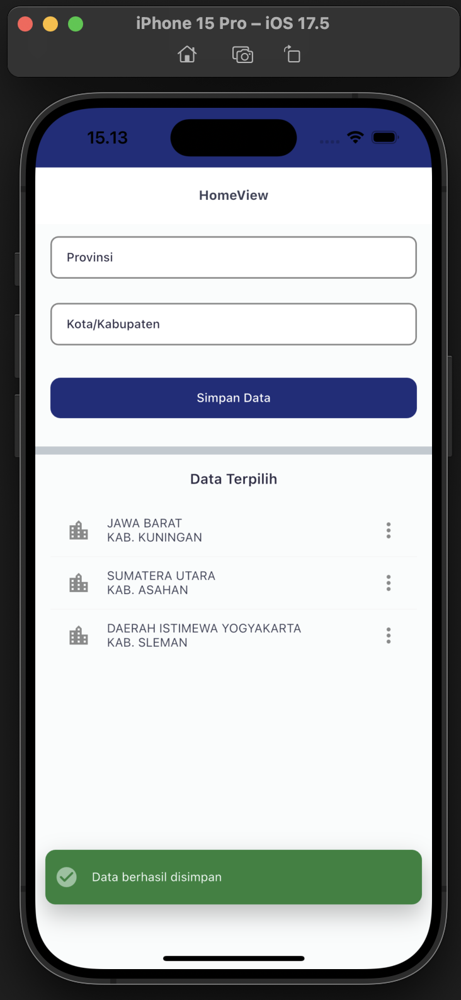
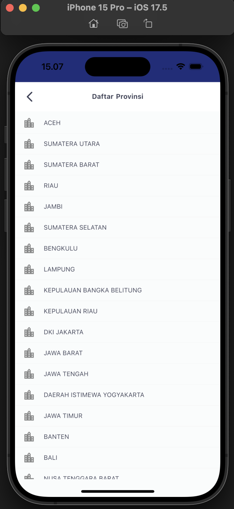
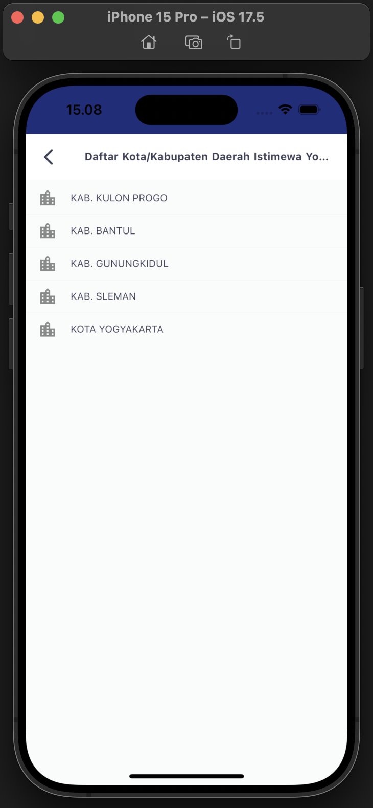
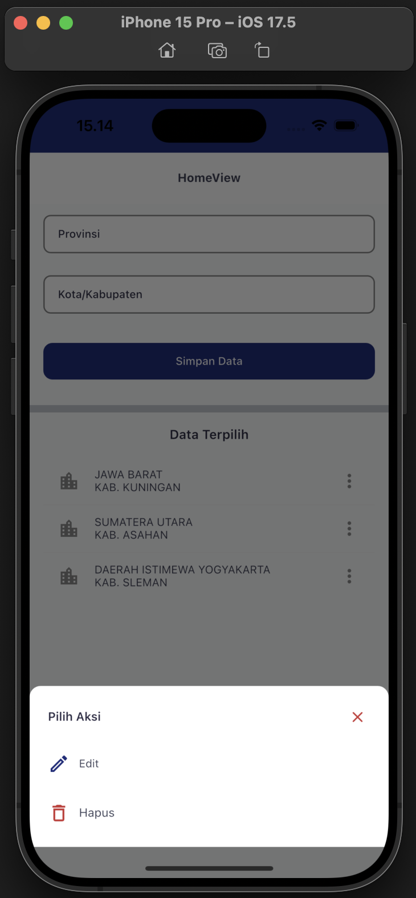
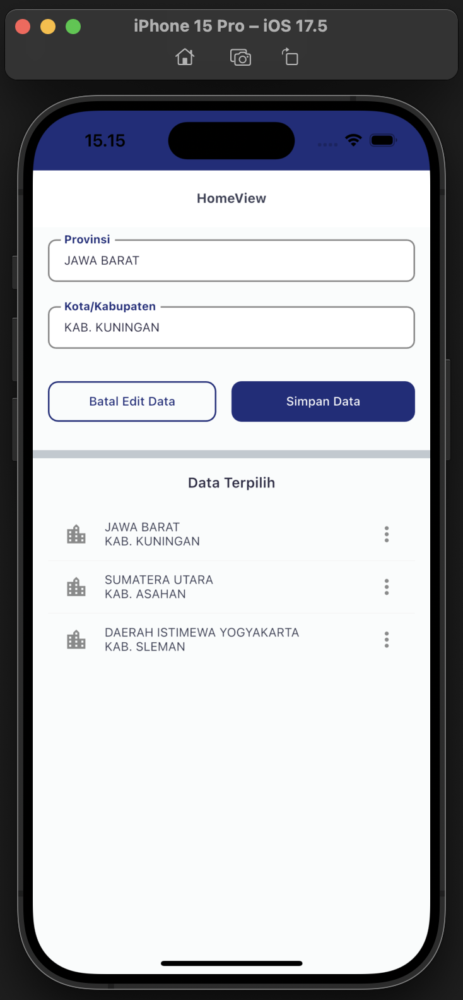

## Getting Started

This project is a starting point for a Flutter application.

A few resources to get you started if this is your first Flutter project:

- [Lab: Write your first Flutter app](https://docs.flutter.dev/get-started/codelab)
- [Cookbook: Useful Flutter samples](https://docs.flutter.dev/cookbook)

For help getting started with Flutter development, view the
[online documentation](https://docs.flutter.dev/), which offers tutorials,
samples, guidance on mobile development, and a full API reference.

## Installation

Get code using

```
git clone https://github.com/syahrulafrizal/jmc-challange-code.git
```

__Step 2__

Install the necessary libraries (this proyect use Flutter 3.24.3)

```
flutter pub get
```

__Step 3__

Run the app

```bash
flutter run
```

## Requirement 🛠 :
- flutter version :  3.24.3

## StakBuild with (libs) 🛠 :
- `get_x`: State Management
- `dio`: Allow connections with server
- `intl`: Internationalization
- `sqflite`: Store local database

## JMC Challange Code

<table>
  <tr>
    <td align="center" valign="center"></td>
  </tr>
  <tr>
    <td align="center" valign="center"></td>
  </tr>
  <tr>
    <td align="center" valign="center"></td>
  </tr>
  <tr>
    <td align="center" valign="center"></td>
  </tr>
  <tr>
    <td align="center" valign="center"></td>
  </tr>
  <tr>
    <td align="center" valign="center"></td>
  </tr>
 </table>

